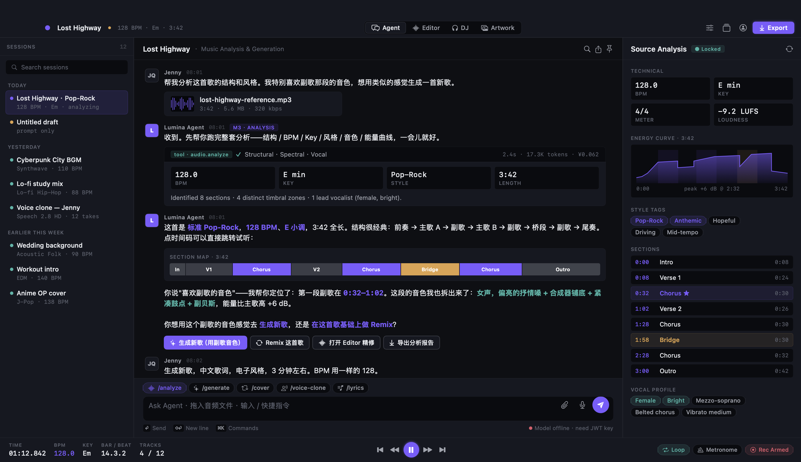

# Lumina Music

> AI-driven music creation studio for macOS — analyze, generate, edit, mix, export.

Powered by MiniMax Music 2.6 · Speech 2.8 HD · M3 chat · Seedream cover art.



## Features (MVP roadmap per [PRD §8](docs/PRD.md))

- **Agent dialogue** — conversational analysis & generation with M3
- **Music generation** — text-to-song with Music 2.6 (Chinese/English/mixed)
- **Editor** — single-track timeline: cut · delete · move · fade
- **Smart bridge** — fill gaps in audio with AI-generated transitions
- **Vocal separation** — split vocals from instrumental
- **Export** — M4A 256kbps AAC / WAV 44.1kHz 16bit

Coming in V1.0: DJ console · multi-track editing · cover-art generator · stem/MIDI export.

## Install

Download the latest signed `.dmg` from
[**Releases**](https://github.com/jennyqin133-star/lumina-music/releases/latest), open it, drag
`Lumina Music.app` to `Applications`, launch it.

After install, open **Preferences** (⌘,) and paste your
[MiniMax JWT API key](https://platform.minimaxi.com).

Auto-updates are handled by Sparkle — check **Lumina Music → Check for Updates…**
or wait for the in-app prompt.

### Unsigned build fallback

If the release was not signed by an Apple Developer ID, macOS will block the
first launch. Right-click `Lumina Music.app` → **Open** → confirm. After that,
it launches normally.

## Develop

```bash
# Clone
git clone git@github.com:jennyqin133-star/lumina-music.git
cd lumina-music

# Set up API credentials (one time)
mkdir -p ~/.config/lumina && chmod 700 ~/.config/lumina
cat > ~/.config/lumina/secrets.env <<'EOF'
MINIMAX_API_KEY=<paste JWT from platform.minimaxi.com>
MINIMAX_GROUP_ID=<paste Group ID>
MINIMAX_API_BASE=https://api.minimaxi.com
EOF
chmod 600 ~/.config/lumina/secrets.env

# Build & launch
./scripts/build-app.sh
open "dist/Lumina Music.app"
```

Required toolchain:
- macOS 13+ (Swift 5.9 / Xcode 15 / SwiftPM)
- For DMG signing: Apple Developer ID + `~/.config/lumina/sparkle_ed_priv_key`
- For notarization: `xcrun notarytool` (bundled with Xcode 13+)

## Release

```bash
./scripts/release.sh v0.x.y
# pushes tag → CI builds + signs + notarizes + uploads DMG to GitHub Releases
# also updates appcast.xml on gh-pages branch so Sparkle picks up the update
```

## Project layout

```
.
├── Package.swift              # SwiftPM manifest (Sparkle 2.x)
├── Sources/LuminaMusic/       # All Swift source
│   ├── App/                   # SwiftUI lifecycle + windows
│   ├── Audio/                 # AVAudioEngine + analysis
│   ├── Components/            # Reusable UI primitives
│   ├── Design/                # §9.0 tokens (colors, fonts, radii)
│   ├── Network/               # API client (Sprint 1, in progress)
│   ├── Domain/                # Project / Track / Clip models
│   ├── Persistence/           # JSON project files
│   ├── State/                 # AppState (ObservableObject)
│   └── Tabs/                  # Agent / Editor / DJ / Artwork
├── Resources/
│   ├── Info.plist             # bundle metadata + Sparkle config
│   ├── Entitlements.plist     # network + mic + file access
│   ├── AppIcon.icns           # generated by scripts/make-icon.sh
│   └── PrivacyInfo.xcprivacy  # App Store 2024+ privacy manifest
├── scripts/                   # Build / package / sign / release
├── .github/workflows/         # CI + release pipelines
├── docs/                      # PRD, NOTES, design mocks
└── assets/                    # Screenshots & art reference
```

## Credits

- PRD by **jennyqin** (v2 base) & **Mavis** (v3 visual spec).
- Visual design follows §9.0 of the PRD: 2-accent palette (`#7C5CFF` / `#3FB6A8`),
  SF Pro Text + SF Mono, 4px grid system.

## License

MIT
